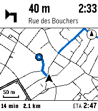
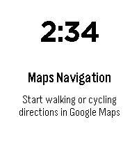
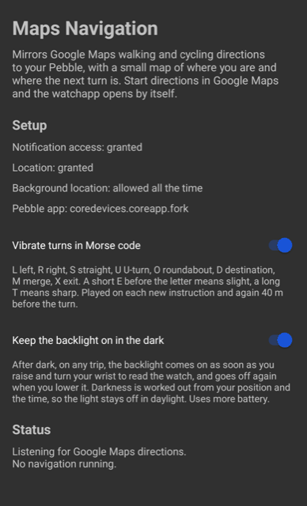

# Maps Navigation for Pebble

Google Maps walking and cycling directions on a Pebble Time 2, with a small map that shows
where you are and where the next turn is.

Start directions in Google Maps on Android. The watchapp opens by itself and shows the next
manoeuvre (Google's own arrow icon, the distance and the street), a heading-up map of the
streets around you with your position, the estimated position of the next turn, the street you
have to turn into, and the trip summary (time left, distance left, arrival time).

Google Maps has no public API for a running navigation. Everything comes from the ongoing
navigation notification it posts, so this is Android only.

## Screenshots

<p>
  
  
</p>

The watchapp during a trip and while it waits for one, at the native 200 by 228 of the Pebble
Time 2. Both come from the emery emulator driven by the companion's demo, so the map is a real
render of the streets around the Grand-Place in Brussels.



The companion on the phone. It lists what the setup needs, carries the two settings and says
what it is doing.

## Name

The product is called Maps Navigation for Pebble in the store and in headings. Everywhere else a
user sees it, on the watch, on the phone and in running prose, it is Maps Navigation.
Identifiers use the code name Maps for Pebble: the repository `peblum/maps-for-pebble`, the
Android package `org.peblum.mapsforpebble`, the class and Gradle project name `MapsForPebble`,
the release assets `maps-for-pebble.pbw` and `maps-for-pebble.apk`. The two are kept apart so
the display name can change without touching an identifier.

The package sits under `peblum.org`, the domain behind the GitHub organisation. It was
`be.pascu.mapsforpebble` up to 1.2.0, which tied a shared project to one person's domain. An
application id is fixed for the life of an install, so the move makes 2.0.0 a separate app rather
than an update to the old one.

## How it works

```
Google Maps (phone)
  posts the ongoing navigation notification (text plus a maneuver icon)
        │
        ▼
Maps Navigation companion (Android, this repo)
  NotificationListenerService reads the text and the icon
  LocationManager gives position, speed and bearing
  OpenFreeMap vector tiles (OpenStreetMap data, zoom 14) are decoded on the phone
  RoutePreview searches the OSM graph ahead for a way of about the announced length
    that ends on the street named in the instruction
  MapRenderer draws a 4 colour, heading-up map on a Canvas and packs it as 2 bits per pixel
        │  PebbleKit Android 2 AppMessages (chunks sized to the watch inbox, up to 8 KB)
        ▼
Maps Navigation watchapp (C, this repo)
  top bar: arrow, distance, street
  map: the phone-rendered bitmap in a palettised GBitmap
  bottom bar: time left and distance left, arrival time on the right
```

The next turn is an estimate. Google only tells us "in 200 m, turn left onto Rue X", never the
route itself. The companion snaps your GPS position to the nearest road, builds a graph of the
loaded OpenStreetMap geometry, and looks for the shortest way ahead of you to a street named
"Rue X" that is about 200 m long. Google measures that 200 m along its own route, so a path of
about the right length ending on the right street is usually the one it is sending you down, and
the blue line then follows the real route through its turns instead of carrying straight on. The
turn is a blue dot where the two streets meet, and the line carries on past it for a short way
on the side the manoeuvre implies. It stays a guess: the map data carries no one way streets and
no turn restrictions, so the line can take a turn a vehicle could not. When no named street sits
at about the announced distance, the line falls back to following the current road ahead, and off
the road network it is a straight line.

Zoom follows the distance to the turn so that the turn is on screen (zoom 14 to 18, capped at
17 when moving faster than 4 m/s, so cycling gets a wider view). Swiping on the watch
overrides it for the rest of the trip.

## Install

Two parts: the watchapp on the watch and the companion on the phone.

1. **Watchapp**: open `maps-for-pebble.pbw` from the latest release in the Pebble app, or build it
   (see below) and sideload it.
2. **Companion**: install `maps-for-pebble.apk` from the latest release. If an earlier build is on
   the phone, whether it called itself Wristmap or Maps Navigation, uninstall it first. Both of
   those used a different package name, so they install alongside this one and would mirror the
   same directions twice. Open the new app once and grant
   notification access, location, and location "all the time". The last one matters: directions
   start while Google Maps is in front, so the companion's location service starts from the
   background, and Android only feeds GPS to such a service when background location is allowed.
   The app lists what is still missing.
3. Start walking or cycling directions in Google Maps. The watchapp pops up on its own.

On the watch: swipe up to zoom in and down to zoom out. The map scales under your finger
immediately from the frame it already has, and the phone follows with a properly rendered
frame within a few hundred milliseconds. Any touch turns the backlight on for five seconds.
The buttons do nothing except back, which leaves the app. A short vibration announces every
new instruction, or, with "Vibrate turns in Morse code" switched on in the phone app (it is on
by default), the manoeuvre itself is tapped out in Morse so you can follow directions without
looking:

| Manoeuvre | Letters | Pattern |
|-----------|---------|---------|
| turn left | L | . - . . |
| turn right | R | . - . |
| straight on | S | . . . |
| U-turn | U | . . - |
| roundabout | O | - - - |
| destination | D | - . . |
| merge | M | - - |
| exit or ramp | X | - . . - |
| slight turn | E then the letter | . then L or R |
| sharp turn | T then the letter | - then L or R |

A dot is 100 ms, a dash 300 ms, symbols are 100 ms apart and letters 300 ms apart, so no cue
is longer than 1.5 s. The cue plays when an instruction first appears and once more when the
turn is 40 m away. The phone builds the pattern (`MorseCue`) and sends it with the
instruction, the watch only plays it.

With "Keep the backlight on in the dark" switched on in the phone app (on by default), the
backlight follows your wrist on any trip after dark. Raise and turn your wrist to read the watch
and the light comes on within about a fifth of a second, lower it again and the light goes off,
with no timer in between. The phone decides that it is dark, from the sun's altitude at your
position and the time of day, and the watch decides that it is held to be read, from its
accelerometer. The five second touch backlight works whatever the light is doing.

The companion needs the Core Devices Pebble app (`coredevices.coreapp`). It is the only Android
app that implements PebbleKit Android 2, which the companion uses to talk to the watch.

## Documentation

The [docs](docs/README.md) folder covers what the phone needs, [how the pieces fit](docs/how-it-works.md),
[how the Google Maps notification is read](docs/google-maps.md) and [troubleshooting](docs/troubleshooting.md).

## Build

Watchapp, with the Core Devices SDK (`uv tool install pebble-tool --python 3.13`, then
`pebble sdk install latest`):

```
cd watchapp
pebble build
pebble install --emulator emery
```

Companion, with JDK 21 and an Android SDK that has platform 37 (PebbleKit Android 2 ships
Java 21 class files, so the unit tests need a 21 runtime):

```
cd android
./gradlew assembleDebug testDebugUnitTest
adb install app/build/outputs/apk/debug/app-debug.apk
```

Formatting and lint run as a pre-commit hook and as the `check` job in CI, through
[pre-commit](https://pre-commit.com): `clang-format` for the C sources, `ruff` for the Python
scripts, `ktlint` (through the Gradle plugin) for Kotlin, `actionlint` for the workflows, and
the Android unit tests with the coverage gate on staged Android files. Kover requires 100%
line, instruction and branch coverage of the pure Kotlin (parsing, tiles, route preview,
encoding, Morse, zoom, chunking). Classes that need Android at runtime (the activity, the
services, the navigator, the renderer, the tile store, the notification reader, the watch
link) are excluded from the measurement and covered by the emulator harness and on-device
runs instead. Install the hook once per clone:

```
pipx install pre-commit
pre-commit install
```

`scripts/emu-send.py` drives the watchapp in the emulator without a phone: it sends a demo
navigation state, a synthetic test pattern, or a frame the companion wrote to its cache
directory (`last-frame.wmf`, pull it with `adb shell run-as org.peblum.mapsforpebble cat cache/last-frame.wmf`).

```
~/.local/share/uv/tools/pebble-tool/bin/python scripts/emu-send.py --launch --demo --pattern
~/.local/share/uv/tools/pebble-tool/bin/python scripts/emu-send.py --frame last-frame.wmf
```

`--launch` restarts the watchapp first so the script sees its hello message, sizes the chunks
the way the companion does (inbox size minus 96 bytes, at most 8000) and draws the test
pattern at the size the watch announced. Without it `--pattern` assumes the emery layout
(200x148), which the watch rejects on a smaller screen such as basalt.

## Releasing

Bump `version` in `watchapp/package.json`, tag the commit `vX.Y.Z` with the release notes as
the tag message, and push the tag. The release workflow checks that the tag matches the
watchapp version, builds both halves, attaches `maps-for-pebble.apk`, `maps-for-pebble.pbw` and checksums to
a GitHub release, and then uploads the `.pbw` as a new release of the appstore listing through
the Rebble developer portal API. Two repository settings drive the last step and the job skips
with a warning while they are missing:

- the variable `REBBLE_APP_ID`, the 24 character id of the listing on
  [dev-portal.rebble.io](https://dev-portal.rebble.io),
- the secret `REBBLE_ACCESS_TOKEN`, the `access_token` the portal keeps in its browser
  local storage after signing in (open the portal, then in the developer tools run
  `localStorage.getItem("access_token")`).

The appstore only accepts a release whose version is higher than every published one, which
the tag check enforces on the repository side.

## Protocol

Both sides use raw integer AppMessage keys, defined in `watchapp/src/c/protocol.h` and
`android/.../pebble/Protocol.kt`. The watchapp UUID is `58b9be94-3f7b-4338-94e5-90890b2ab7a0`
and the companion package `org.peblum.mapsforpebble` is whitelisted in `watchapp/package.json`.

Phone to watch:

| Key | Name | Type | Meaning |
|----:|------|------|---------|
| 1 | `NAV_ACTIVE` | uint8 | 1 while navigating, 0 clears the screen |
| 2 | `MANEUVER` | uint8 | fallback arrow when no icon was captured |
| 3 | `ARROW_BITMAP` | bytes | 40x40, 1 bit per pixel, 5 bytes per row, MSB first |
| 4..9 | `DISTANCE`, `STREET`, `INSTRUCTION`, `ETA`, `DIST_REMAIN`, `TIME_REMAIN` | cstring | display text |
| 10 | `HAPTIC_PATTERN` | bytes | vibration segments as little-endian uint16 milliseconds, on and off alternating, starting with on, at most 32 |
| 11 | `KEEP_LIT` | uint8 | 1 while the phone wants the backlight kept on, the watch then lights it whenever it is tilted to be read |
| 20, 21 | `MAP_WIDTH`, `MAP_HEIGHT` | uint16 | frame size, sent with the first chunk |
| 22 | `MAP_FRAME` | uint8 | frame id, chunks of another frame are dropped |
| 23 | `MAP_TOTAL` | uint32 | total packed bytes |
| 24, 25 | `MAP_OFFSET`, `MAP_DATA` | uint32, bytes | one chunk |
| 26 | `MAP_ZOOM` | uint16 | zoom of the frame times 100, sent with the first chunk, lets the watch scale it locally while the finger is down |

Chunks of a frame arrive in order: the watch expects each `MAP_OFFSET` to equal the number
of bytes it already has, ignores a chunk with a lower offset as a duplicate, and drops the
whole frame on any other gap until the next header. A header whose width or height exceeds
the map area announced in `HELLO` is rejected.

Watch to phone:

| Key | Name | Type | Meaning |
|----:|------|------|---------|
| 40 | `HELLO` | uint8 | sent when the watchapp starts |
| 41 | `INBOX_MAX` | uint32 | `app_message_inbox_size_maximum()`, sizes the chunks |
| 42, 43 | `MAP_VIEW_WIDTH`, `MAP_VIEW_HEIGHT` | uint16 | the map area the watch has |
| 45 | `ZOOM_LEVEL` | uint16 | wanted zoom times 100, sent while swiping, at most every 120 ms |

Map frames are packed 2 bits per pixel, 4 pixels per byte, most significant bits first, rows
byte aligned, exactly the layout of `GBitmapFormat2BitPalette`. Palette: 0 white, 1 black,
2 light grey (water), 3 blue (route preview, turn, next street).

## Findings worth writing down

- **The Core Devices SDK breaks when its virtualenv and pebble-tool use different Pythons.**
  `pebble build` runs waf with `SDKs/<version>/.venv/bin/python` and `PYTHONPATH` set to
  pebble-tool's own `sys.path`. A venv created by Homebrew Python 3.14 combined with a
  pebble-tool installed under uv's Python 3.13 dies with `No module named '_struct'`. Recreate
  the venv with the same interpreter (`uv venv --python 3.13 .venv`, then install
  `freetype-py sh pypng` into it).
- **PebbleKit Android 2 1.3.0 needs `compileSdk 37` and Kotlin 2.4.** Its AAR metadata refuses
  compileSdk 36 and its classes carry Kotlin 2.4 metadata, which Kotlin 2.2 cannot read.
- **8 KB AppMessages need two things**: the phone must advertise the `Supports8kAppMessage`
  capability (the Core Devices app does) and the app must be built with SDK version 5.63 or
  later (SDK 4.33 builds emery apps as 5.106). Otherwise `app_message_inbox_size_maximum()`
  falls back to about 2 KB, so the companion always sizes chunks from the value the watch
  reports in `HELLO` instead of assuming.
- **OpenFreeMap tiles need the dated URL from the TileJSON.** `https://tiles.openfreemap.org/planet/14/x/y.pbf`
  answers 200 with an empty body. The TileJSON at `/planet` names the current tileset, for
  example `.../planet/20260830_080001_pt/{z}/{x}/{y}.pbf`. The companion caches the TileJSON
  for a day and tiles for two weeks.
- **Absolute Web Mercator coordinates do not fit in a float.** At zoom 14 with 4096 units per
  tile the world is 67 million units wide, so a float near Brussels has a resolution of 4
  units, about 3 m. Tiles keep tile-local coordinates and the renderer translates per tile.
- **Palettised Pebble bitmaps are packed most significant bits first**, unlike the legacy 1 bit
  format where bit 0 is the leftmost pixel. Verified in `raw_image_get_value_for_bitdepth()`
  in PebbleOS and on the emulator.
- **Anti-aliasing is the enemy of a 4 colour display.** With every paint set to
  `isAntiAlias = false` every pixel lands exactly on a palette entry and the map stays crisp.

## Icon

`branding/icon.svg` is the store icon: a route turning onto the street ahead, with your position
at its start, drawn in blue and white on a dark rounded square. The store renders it at 144 and
48 pixels. Its glyph sits in the middle of the square, 20.5 units of clear space to the left and
right and 16.5 above and below, on a 144 unit grid.

`watchapp/resources/images/menu_icon.png` is the same motif redrawn by hand for the watch menu,
25 by 25 pixels of black and blue on white, and it is centred the same way. It is a separate
drawing rather than a rendering of the SVG, because the shapes have to land on whole pixels at
that size.

The Android launcher and the notification use a different mark, an arrow, defined in
`android/app/src/main/res/`.

## Credits

- The notification reading approach (recover the RemoteViews, walk every TextView, take the
  icon of `nav_notification_icon`) follows [3v1n0/GMapsParser](https://github.com/3v1n0/GMapsParser)
  and [konsumer/pebble-map-android](https://github.com/konsumer/pebble-map-android).
- Map data © [OpenStreetMap](https://www.openstreetmap.org/copyright) contributors, served by
  [OpenFreeMap](https://openfreemap.org) © [OpenMapTiles](https://www.openmaptiles.org/).
- [PebbleKit Android 2](https://github.com/pebble-dev/PebbleKitAndroid2) and the
  [Core Devices Pebble SDK](https://developer.repebble.com/).

## License

MIT, see `LICENSE`.

---

## Prompts

This project was written end to end by Claude across two sessions. The prompts, verbatim and
in order, typos included.

1. I need an app for my pebble time 2, the one that recently came out. I need an app that integrates into google maps and shows me the map to help me navigate. It only needs to work when I am already navigating in bicycle mode or walking via google maps on my android.

   Either reuse an app, fork an app or build one from scratch.

   Do the best you can and do /mr-polish on the codebase when done.

   /ship-public-app it on my pascu.be website as well, do the best you can, I am leaving you unattended. If you need me for anything, let me know after you have the app running, we can iterate on it together, yet do the ebst you can unatended until lthen.
2. You can use any other claude session on this PC for inspiration
3. Make sure we can see a little preview of where we are and the next turn, a little map or similar visualisation, goal is to see when the next turn is somehow.
4. also uninstal and revert any changes you did to this computer when you are done
5. resume
6. real android phone and watch connected (adb and bt), you can use them to debug,. test, develop, etc.

   When done make sure the new app is installed on my watch and is functional
7. test on the real devices to make sure it works
8. /mr-new /mr-polish and merge: add an icon to the app

   /mr-new /mr-polish and merge: make swiping up and down change zoom levels, make this smooth on drag instant responce, zero start lag, zero start distance zero start delay time, instant touch and swipe and instant zoom reaction. When the screen is touched it lights up and stays up for 5s when in this app. Disable the buttons and remove that featuer entirely that shows up when you press the middle butotn
9. /mr-new /mr-polish and merge: add a feature that can be on/off, configurable via the app, this feature is turn by turn navigation via the taptic engine thing it has, use the most popular standard short vibration code type of language and encode in as short as possible turn by turn navigation, use best communication prtactices for as short as possible yet standardized undarstable turn by turn navigation
10. /mr-new /mr-polish and merge: add documentation in the repo explaining how the pebble app works, hot its impkemented, how it communicates to google maps, if this needs anything extra installed on the phone to work etc
11. Btw, I want to discuoonect my phone from usb, transition it to adb over wifi so I can safle remove it from usb and you keep using it over WiFi
12. add a global claude commadn to kee the phone awake, see recent claude sessions for inspiration on how to do it in a way that nothing is ever instaslled and no configs are changerd on thje phone

    use it, keep the phone awake

    after you are done, do market research of this app vs any other pebble app competitors, show me this via a claude artifact

    If we have a decent chance of being the market leader for this category of pebble app, the take in the best practices from the bachata-bot repo, all that CI/CD unit test, lint etc type of project structure and add in tinto this pebble ap repo, add do /mr-new and /mr-polish on it and megge it in.

    Then do anoter /mr-new and /mr-polish to implent a CI/CD pipeline to auto publish the app on the pebble store from the repo, you can use login with google ****@gmail as a primary way to make or login to accounts, otherwise use bitwarden via the bitwarden skill.

    Also make a global claude.md command to make add this stuff that we are  pulling in from bachata bot now, search inspiration on how we pulled such best practices into other repos from bachata-bot, and make this command in a way thats reusable and we can run it on any repo to promote its code quaity to our standards.
13. Continue from where you left off.
14. resume
15. /mr-new /mr-polish and merge, make the clock larger and make it show near the top, it should be easily readable and mixed in nicely with the nav data
16. I don't like the current app name, lets pause to do a brainstorming session to find the best name

    after this resume things as usual

    When he decided on the new name, do /mr-new and /mr-polish to swap into the first name, make sure to publish under the new name.

    Let's brainstorm

    Give me options, I want something that is easy to pronounce, easy to spell, relatively short and won't break treadmarks / copyrights (won't get us sued)
17. give me more options first, let's talk over chat and decide there
18. use the bitwarden skill to unlock it now in case you need it later

    also make sure the project lives under my pebble fork org.

    Since we mix two products, I want to try to use their names as much as possible

    like "X for Y" or something like that

    still make it in a way that we won't get sued
19. Only keep for Pebble options
20. also prefer some name that will SEO well in general on google and also on the pebble app store
21. go ahead with Maps Navigation for Pebble

    Yet internally just call it Maps for Pebble (for any internal code names, repo name etc), it is very likely in the future we will rename it to just Maps for Pebble, so use that for any immutable places like app id string etc.

    Resume work now.

    Do as many /mr-new and /mr-polish and merges as needed to reach all our goals.

22. /mr-new /mr-polish show the estimated time of arrival somehwre as well. Make sure it fits in with the general design of the UI.

    Show screenshots of the before and after version of any UI change MRs in the MR description.

    Merge this MR when ready
23. rename tockstone to a mix of rebble and pebble and chromium.

    I mean the org that these sit in on gh

    Let's brainstorm the names first
24. cleanup a bit my chrome tabs, close all duplicates of the same link

    Close all linkedin ones, close all gogel claendar ones in general

    Close any gitlab ones as well

    Close any meetup ones

    close any latindance.be ones
25. make sure to clean up after youreself, uninstall any global stuff you might hacve installed, close any unused emualtors and tabs might've opened
26. where si the brainstorming session?
27. Keep only easy to pronounce and spell options
28. avoid double letters
29. Do Rebrium
30. Rename the fork that lives under iut as well via /mr-new /mr-polish and merging in te changes

    Repeat as many MRs as needed.

    resume work on the rest
31. wait, maybe make it easy to pronounce and spell for people that roll their R'sI feel the name can still be improved
32. What about peblium?
33. I want it to sound like a chemical element
34. is this easy to pronounce and spel in all cultures?
35. do peblum if free, resume

36. /mr-new /mr-polish and mege it in, add a setting that is enabled by default to make the backlight stay on while in this app when the watch is not upside down , ofc reword this setting to follow best practices

    (and make this only apply for when doing bicycle navigation)
37. make sure last version is installed
38. Finish the ideas behind all open MRs, do /mr-polish on them and merge them in, see this session for any contextmake sure to do all the features I asked you as well, via /mr-new /mr-polish and merge it inAt the end make sure latest app is installed on my watch

39. Update gobal claude md to do this type of cleanup in each session like I asked you here of unused resources, chrome tabs, globally installed tools, VMs etc. If anything was done that mutated the system state globally, undo it when unused. Clean up  everything unless its something the user asked for to stay.
40. resume

41. finish work pn PR1, do /mr-polish on it and merge it in
42. make sure fioal version of the app is installed on my pebble
43. all done?

43 prompts. One multiple-choice question, answered in free text as prompt 17. 0 lines of code
written or edited by a human. One address in prompt 12 is masked.
